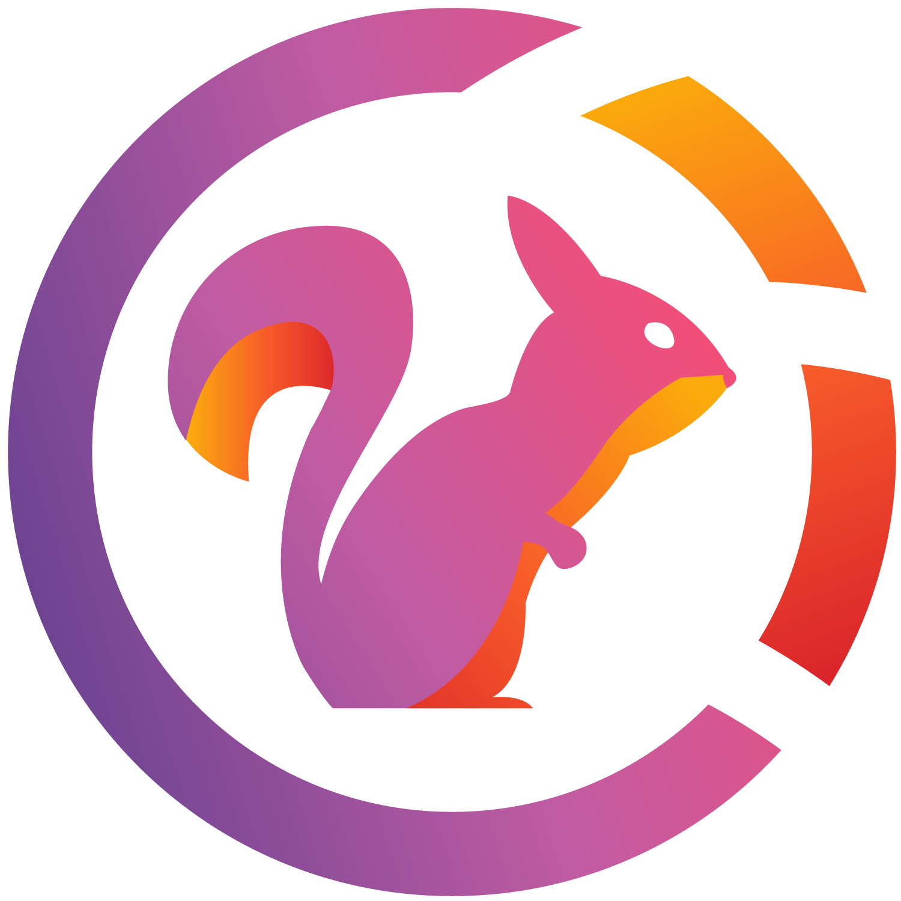

# SQUIRREL NETWORK

## 👥 Groups

<ul>
<li><a href="https://t.me/javascript_ita">Javascript</a></li>
<li><a href="https://t.me/html_css_ita">HTML/CSS</a></li>
<li><a href="https://t.me/java_italia">Java</a></li>
<li><a href="https://t.me/php_italia">PHP</a></li>
<li><a href="https://t.me/cpp_ita">C/C++</a></li>
<li><a href="https://t.me/csharp_ita">C#</a></li>
<li><a href="https://t.me/pythonitalia_principianti">Python</a></li>
<li><a href="https://t.me/programmazione_ita">Programmazione</a></li>
<li><a href="https://t.me/react_ita">ReactJS</a></li>
<li><a href="https://t.me/angular_ita">Angular</a></li>
<li><a href="https://t.me/dockerita">Docker</a></li>
<li><a href="https://t.me/noderedIT">NodeRed</a></li>
<li><a href="https://t.me/linuxnetwork">Linux Network</a></li>
<li><a href="https://t.me/offtopic_ita">OffTopic</a></li>
<li><a href="https://t.me/seo_sem_it">SEO_SEM_ITA</a></li>
<li><a href="https://t.me/ocamlita">OCaml Ita</a></li>
<li><a href="https://t.me/ux_italia">UX Italia</a></li>
<li><a href="https://t.me/sysadminita">SysAdmin Italia</a></li>
<li><a href="https://t.me/reasonml_ita">ReasonML Ita</a></li> 
</ul>

## 📝Channels

<ul>
<li><a href="https://t.me/FreeGameCodes">FreeGames</a></li>
<li><a href="https://t.me/nebulanews">Nebula News</a></li>
<li><a href="https://t.me/nebulalogs">Nebula Logs</a></li>
</ul>

## 🤖Bots

<ul>
<li><a href="https://t.me/thenebulabot">Nebula</a></li>
<li><a href="https://t.me/zampathebot">Zampa</a></li>
</ul>
